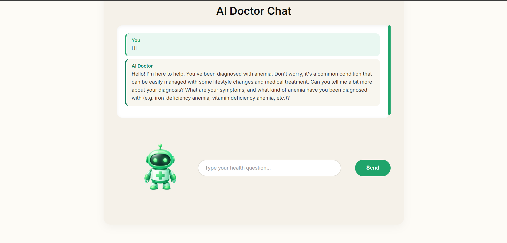

## 🖼 Sample Output

    
    
    
     
    
  

🩺 CURA AI – Intelligent Medical Assistant

CURA AI is an AI-powered healthcare platform that helps users predict possible diseases based on their symptoms, consult an AI doctor, and generate professional medical reports — all in one place.

The goal of CURA AI is to make healthcare more simple, fast, and accessible for everyone.

--------------------------------------------------------------------------------------------------------------------------------------------------------------------------------------------------------------------

✨ Features

AI Disease Prediction
Uses a trained machine learning model to analyze 30+ symptoms and predict 20+ diseases.

AI Doctor Chatbot
An intelligent medical assistant that gives friendly and safe health guidance.

Symptom Checker
Users can select symptoms in a simple UI and get instant results.

Doctor Recommendation System
Suggests the right specialist (General Physician, Cardiologist, Pulmonologist, etc.)

Medical Report Generator
Generates professional hospital-style PDF medical reports.

User Accounts
Secure login & signup system with stored patient information.

--------------------------------------------------------------------------------------------------------------------------------------------------------------------------------------------------------------------

🧠 Tech Stack

Frontend:

React (Vite)

Modern UI with animations and medical-themed design

Backend:

Python

Flask

Flask-SQLAlchemy

Flask-JWT-Extended

Groq AI API

ReportLab (PDF generation)

Machine Learning:

Scikit-learn

Trained on 30+ symptoms & 20+ diseases

--------------------------------------------------------------------------------------------------------------------------------------------------------------------------------------------------------------------

⚙️ Setup & Run

Backend:

cd backend

python -m venv venv

venv\Scripts\activate

pip install -r requirements.txt

python app.py

Create a .env file:

GROQ_API_KEY=your_api_key_here

Backend runs on:

http://127.0.0.1:5000

Frontend:

cd frontend

npm install

npm run dev

Frontend runs on:

http://localhost:5173

--------------------------------------------------------------------------------------------------------------------------------------------------------------------------------------------------------------------

🩻 How It Works

User signs up and logs in

Selects symptoms

AI predicts possible disease

User chats with AI Doctor

Downloads medical report

--------------------------------------------------------------------------------------------------------------------------------------------------------------------------------------------------------------------

🔐 Privacy & Safety

User data is securely stored

Reports are generated only for the logged-in user

AI provides guidance but does not replace real doctors

📌 Project Goal

To make healthcare smarter, faster, and more accessible using AI and machine learning.

--------------------------------------------------------------------------------------------------------------------------------------------------------------------------------------------------------------------

 Built by...

Bhanu💚
